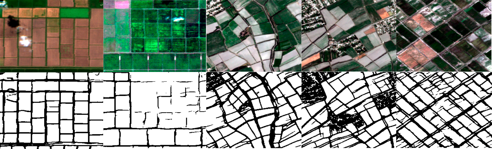

# hrnetv2-pytorch-delineation
 Implementation of HRNetv2 from paper "Deep High-Resolution Representation Learning for Visual Recognition" for crops delineation
 
 
 
 ## Some results:
 
  
  
  `Dice mask = 0.8`
  `Dice borders = 0.66`
  
 ## Differences with original paper:
 
 - Input is 4 channel image (RGB + NIR from Sentinel-2)
 - Input stem converts image to 1/2 of its size (was 1/4 according to the original paper),
   so 1 upsample and its bn deleted from fcn head too
 - Labels are: mask and borders
 - Output mask is 2 channel (Mask + Borders)
 - Weight iniitialization changed from normal to kaiming
 - BCE Loss changed to Dice + BCE Loss
 - SGD changed to Adam
 - Last 2 Upsample layers in FCN Segmentation head is changed to ConvTranspose2D
 - New data augmentations during training
 - Added augmentations during inference (InferenceAugmentor class in dataset.py)
 - Evaluation is performed with Dice coef

#### Saved checkpoint is stored as `pytorch_hrnetv2-1div2-size_vnir+borders+new_aug+dicebce-224x224_epoch-50.pth` in S3 `serving-models` bucket

## Usage:

- process all files inside `test_imgs` dir (masks saved in results dir) 
`python predict.py -type batch -m checkpoints/pytorch_hrnetv2-1div2-size_vnir+borders+new_aug+dicebce-224x224_epoch-50.pth -t 0.2`

- process 1 file
`python predict.py -type single -m checkpoints/pytorch_hrnetv2-1div2-size_vnir+borders+new_aug+dicebce-224x224_epoch-50.pth -i test_imgs/test1.tiff -t 0.2`

- threshold 0.2 is selected as best
